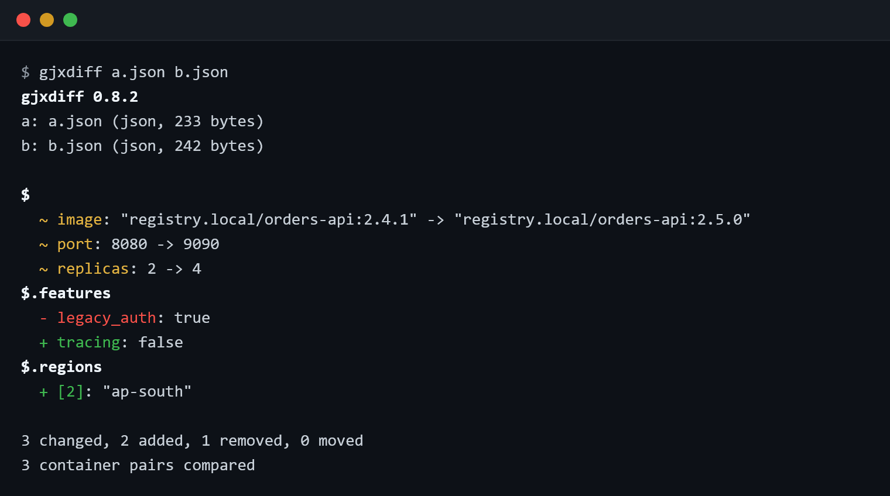
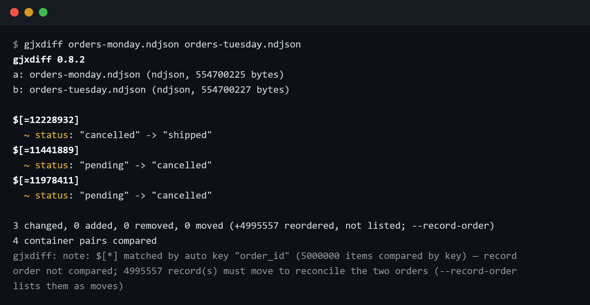

# gjxdiff

Structural diff for JSON and NDJSON files — of any size.

Point it at two files and it tells you what actually changed: added, removed and
changed values, renamed keys, type changes, moved subtrees. Here it compares two
versions of a small service config:



That answer took no flags. Now the same command on the workload the tool is
actually built for — two exports of **five million order records, 555 MB each**,
where the second export is sorted differently. A line-based `diff` would flag
nearly every line; `gjxdiff` autodetects `order_id` as the record key, matches
the records order-insensitively, absorbs the re-sort and reports the three
records whose values really differ:



That run took about 16 seconds on a small 4-core VM, in bounded memory —
neither file is ever loaded into RAM, so the same command works when the inputs
are 50 GB and the machine has 8.

Pipe the same run and it becomes a machine report — NDJSON, one JSON object per
record, built for `jq` and scripts:

```sh
gjxdiff orders-monday.ndjson orders-tuesday.ndjson > report.ndjson
```

```json
{"gjxdiff":1,"tool":"0.8.2","stability":"draft","a":{"name":"orders-monday.ndjson","bytes":554700225,"format":"ndjson"},"b":{"name":"orders-tuesday.ndjson","bytes":554700227,"format":"ndjson"},"filters":{"key":null,"ignore":[],"path":null,"align_cap":null,"move_cap":null,"max_diffs":null,"only":null,"large_arrays":"coarse"}}
{"i":0,"op":"changed","path":"$[*].status","ptr":"/232125/status","a_off":247274707,"a_len":11,"b_off":25751743,"b_len":9,"flags":["keyed"]}
{"i":1,"op":"changed","path":"$[*].status","ptr":"/3510995/status","a_off":159960739,"a_len":9,"b_off":389509081,"b_len":11,"flags":["keyed"]}
{"i":2,"op":"changed","path":"$[*].status","ptr":"/4420635/status","a_off":219481733,"a_len":9,"b_off":490425292,"b_len":11,"flags":["keyed"]}
```

Every record carries an RFC 6901 pointer and the exact byte offsets of the old
and new value in the original files, so a consumer can pull any value straight
out of the inputs without parsing them.

## More examples

```sh
# Just the answer: exit 0 identical, 1 differences, 2 error.
gjxdiff --quiet a.json b.json

# Totals only.
gjxdiff --stat a.json b.json

# Match records by a compound key, ignore volatile fields.
gjxdiff --key region,id --ignore ts,updated_at events-a.ndjson events-b.ndjson

# Compare one subtree; export an RFC 6902 JSON Patch.
gjxdiff --path '$.data.items' --patch changes.json config-a.json config-b.json

# Compare a live API response against a saved snapshot.
curl -s https://api.example.com/items | gjxdiff - snapshot.json

# CI gate: machine report, no color, no progress; the exit code answers.
gjxdiff --profile ci orders-old.ndjson orders-new.ndjson > report.ndjson
```

## Why it exists

Most JSON diff tools parse both documents into memory before they compare
anything. That works until the files stop fitting in RAM. `gjxdiff` is built for
the other case: multi-gigabyte exports, database dumps, NDJSON event logs and
API snapshots where the interesting question — "what actually changed between
these two?" — has to be answered on a machine that cannot hold either file.

It is a comparison tool, not a validator, and it makes no attempt to be clever
about what it cannot prove. Anything the comparison skips, absorbs or coarsens
is disclosed on stderr, and the exit code always reflects the full comparison.

The name stands for GiantJSON x86 DIFF: gjxdiff started as a side product of
[GiantJSON Viewer+](https://giantjson.com), an Android app for working with
multi-gigabyte JSON files on a phone. The same problem exists on servers, so
the diff idea got its own standalone tool.

## Highlights

- **Bounded memory, independent of input size.** Inputs are memory-mapped, never
  loaded; working state lives in temporary files under a memory budget
  (`--memory-limit`, default a fixed 4 GiB). The tool aborts with a clear error
  rather than exceed the budget — or exceed what the machine or a container's
  memory limit can actually give (the guard understands cgroups; details in the
  [manual](doc/MANUAL.md#8-large-inputs)).
- **Deterministic.** The same inputs and flags produce a byte-identical report on
  any machine. The default budget is a fixed number rather than a share of free
  RAM, so nothing in the report depends on the machine's momentary state.
- **JSON and NDJSON, detected per file.** A JSON file can be compared against an
  NDJSON file; one side may be standard input (`-`), and either side may be a
  process substitution or a named pipe.
- **Key-based record pairing** (`--key`, compound keys, autodetection) so
  reordered records are not reported as churn — with the number of records that
  moved disclosed on stderr, and `--record-order` to list them as move pairs.
- **Narrowing:** `--path` compares one subtree, `--ignore` excludes volatile
  fields at any depth or by anchored path.
- **Report filtering** (`--only`) and flag bundles (`--profile ci|quick|thorough`).
- **RFC 6902 JSON Patch export** (`--patch`) that transforms A into B, or fails
  loudly — never a silently partial patch.
- **Nothing left behind.** Temporary files are removed on every exit path,
  including Ctrl-C; whatever a hard kill leaves, the next start sweeps.

## Limitations

- Linux x86-64 only. No Windows, macOS or ARM builds.
- Single-threaded by design. A large diff takes the time it takes.
- Binary-only, proprietary. Free for individuals and organizations under 100
  people; see [LICENSING.md](LICENSING.md).
- Very large containers above the alignment cap are reported as one coarse
  region each (disclosed on stderr; the cap rises with `--memory-limit` or
  `--align-cap`).
- Moves are reported only for whole containers of at least 64 bytes. Smaller
  moved items appear as remove + add.
- At most 65,535 distinct paths per report.
- It is a comparison tool, not a validator or repair tool. Malformed input is
  an error.

## Install

`gjxdiff` ships as a prebuilt, dependency-free static Linux binary. Take it from
[`dist/latest/`](https://github.com/kotysoft/gjxdiff/tree/main/dist/latest/),
verify the checksum, and drop it anywhere on your `PATH`:

```sh
install -m 0755 gjxdiff /usr/local/bin/gjxdiff
gjxdiff --version
```

Shell completions are generated by the binary itself:

```sh
gjxdiff --completions bash > /etc/bash_completion.d/gjxdiff
```

Step-by-step download, checksum verification, man page and completion setup:
[INSTALL.md](INSTALL.md).

`gjxdiff` is pre-1.0 software: the report format and flags may still change
between minor releases (the report's meta line carries `"stability":"draft"`
until the v1 schema freeze).

## Exit codes

| Code | Meaning |
|------|---------|
| 0 | Inputs are identical — byte-identical, identical under semantic comparison (whitespace, number and string-escape representation normalize), or identical apart from `--ignore`d content. |
| 1 | Differences found. Includes order-only differences (which produce zero records) and runs whose every record was suppressed by `--only`. |
| 2 | Error: malformed input, invalid flags, a failed patch export, or a tripped memory or temp budget. No report is emitted. |
| 130 | Interrupted (SIGINT/SIGTERM). Temporary files are removed (a second signal within the shutdown's first milliseconds can outrun cleanup; the next start sweeps what remains); any stdout already flushed is a truncated prefix. |

## License

`gjxdiff` is proprietary software that is free to use for individuals and small
organizations.

- **Free** for an individual, or an organization with fewer than 100 employees and
  contractors — including your own automation and CI.
- **Large organizations**: interactive use by a person is free; any automated use
  (CI pipelines, servers, scheduled jobs, production) requires a commercial license.
- **Embedding or redistributing** inside a product requires a commercial license,
  except in a genuinely free (non-monetized) application.
- All free use requires attribution: `gjxdiff by Tibor Kovacs (Kotysoft)`. A
  non-prominent placement — an about, info or credits section, or the accompanying
  documentation — is sufficient.

Source code is not distributed. Copyright (C) 2026 Tibor Kovacs (Kotysoft). See
[LICENSE](LICENSE) for the full terms, which govern, and
[LICENSING.md](LICENSING.md) for the same rules in plain language. Commercial
licensing: support@giantjson.com

## Documentation

- [INSTALL.md](INSTALL.md) — download, verify, install.
- [LICENSING.md](LICENSING.md) — who can use it free, in plain language.
- [doc/MANUAL.md](doc/MANUAL.md) — full user manual, including a
  troubleshooting section that explains every disclosure the tool can print.
- [doc/QUICKREF.md](doc/QUICKREF.md) — one-page cheat sheet.
- [doc/gjxdiff.1](doc/gjxdiff.1) — man page (`man -l doc/gjxdiff.1`).
- [RELEASENOTES](RELEASENOTES) — what changed in each release, and the known
  limits.
- `gjxdiff --help` and `gjxdiff --about`.
